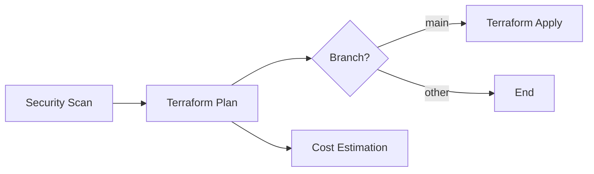

# GitHub Actions Setup Guide

## 📋 Mục lục

- [Giới thiệu](#giới-thiệu)
- [Cấu hình Secrets](#cấu-hình-secrets)
- [Workflows Available](#workflows-available)
- [Cách sử dụng](#cách-sử-dụng)
- [Troubleshooting](#troubleshooting)

---

## 🎯 Giới thiệu

Project này sử dụng GitHub Actions để tự động hóa:
- ✅ Security scanning với Checkov
- ✅ Terraform validation và formatting
- ✅ Infrastructure deployment
- ✅ PR reviews với automated comments

## 🔐 Cấu hình Secrets

### Bước 1: Truy cập GitHub Repository Settings

1. Vào repository của bạn trên GitHub
2. Click **Settings** (tab bên phải)
3. Trong sidebar bên trái, click **Secrets and variables** → **Actions**

### Bước 2: Thêm Secrets

Click **New repository secret** và thêm các secrets sau:

#### Required Secrets

| Secret Name | Mô tả | Cách lấy |
|------------|-------|----------|
| `AWS_ACCESS_KEY_ID` | AWS Access Key ID | IAM Console → Users → Security credentials |
| `AWS_SECRET_ACCESS_KEY` | AWS Secret Access Key | Tạo cùng lúc với Access Key |

#### Optional Secrets (cho features nâng cao)

| Secret Name | Mô tả | Cách lấy |
|------------|-------|----------|
| `INFRACOST_API_KEY` | Cost estimation | https://www.infracost.io/ |
| `SLACK_WEBHOOK_URL` | Notifications | Slack App Settings |

### Bước 3: Tạo AWS IAM User cho GitHub Actions

```bash
# Tạo IAM user
aws iam create-user --user-name github-actions-terraform

# Attach policies
aws iam attach-user-policy \
  --user-name github-actions-terraform \
  --policy-arn arn:aws:iam::aws:policy/PowerUserAccess

# Tạo access key
aws iam create-access-key --user-name github-actions-terraform
```

**⚠️ Security Best Practices:**
- Sử dụng IAM policies với least privilege
- Rotate access keys thường xuyên
- Enable MFA cho production accounts
- Sử dụng OIDC thay vì static credentials (khuyên dùng)

### Bước 4: Configure GitHub Environments

1. Vào **Settings** → **Environments**
2. Tạo environment: `production`
3. Thêm **Protection rules**:
   - ✅ Required reviewers (1-6 người)
   - ✅ Wait timer (optional)
   - ✅ Deployment branches (only main)

---

## 🔄 Workflows Available

### 1. Terraform CI/CD (`terraform.yml`)

**Triggers:**
- Push to `main` → Full deployment
- Push to `develop` → Plan only
- Pull request → Scan + Plan + Comment
- Manual trigger → Custom action

**Jobs:**


**Stages:**
1. **Security Scan**: Checkov scanning
2. **Terraform Plan**: Validate + Plan
3. **Terraform Apply**: Deploy (main only)
4. **Cost Estimation**: Calculate costs (PR only)

### 2. Checkov PR Scan (`checkov-pr.yml`)

**Triggers:**
- Pull requests touching `terraform/**`

**Features:**
- ✅ Fast security check
- ✅ Automated PR comments
- ✅ JSON report artifacts

### 3. Terraform Destroy (`terraform-destroy.yml`)

**Triggers:**
- Manual workflow dispatch only

**Safety:**
- ⚠️ Requires typing "destroy" to confirm
- ⚠️ Environment protection
- ⚠️ Audit logging

---

## 🚀 Cách sử dụng

### Scenario 1: Development workflow

```bash
# 1. Tạo branch mới
git checkout -b feature/add-database

# 2. Thực hiện thay đổi
vim terraform/database.tf

# 3. Test locally
cd terraform
terraform fmt
terraform validate
../scripts/checkov-scan.sh

# 4. Commit và push
git add .
git commit -m "Add RDS database"
git push origin feature/add-database

# 5. Tạo Pull Request
# GitHub Actions sẽ tự động:
# - Run Checkov scan
# - Run Terraform plan
# - Comment kết quả vào PR
```

### Scenario 2: Deploy to production

```bash
# 1. Merge PR vào main
git checkout main
git pull origin main

# 2. Push sẽ trigger deployment
git push origin main

# GitHub Actions sẽ:
# - Security scan
# - Terraform plan
# - Terraform apply (sau approval nếu có protection)
```

### Scenario 3: Manual deployment

1. Vào tab **Actions**
2. Chọn workflow **Terraform CI/CD**
3. Click **Run workflow**
4. Chọn branch và action
5. Click **Run workflow**

### Scenario 4: Destroy infrastructure

⚠️ **WARNING: This is destructive!**

1. Vào tab **Actions**
2. Chọn workflow **Terraform Destroy**
3. Click **Run workflow**
4. Type: `destroy`
5. Select environment
6. Confirm

---

## 📊 Monitoring & Notifications

### View workflow runs

1. Tab **Actions** → Chọn workflow
2. Click vào run cụ thể
3. Xem logs chi tiết cho mỗi job

### Artifacts

Sau mỗi run, các artifacts sau được lưu:

| Artifact | Retention | Purpose |
|----------|-----------|---------|
| `checkov-security-report` | 30 days | Security findings |
| `terraform-plan` | 7 days | Plan for review |
| `terraform-outputs` | 30 days | Infrastructure outputs |

### PR Comments

GitHub Actions tự động comment vào PR với:
- 🔒 Checkov scan results
- 📖 Terraform plan preview
- 💰 Cost estimation

---

## 🐛 Troubleshooting

### Error: AWS credentials not configured

**Solution:**
```bash
# Verify secrets are set
# Settings → Secrets and variables → Actions
# Check: AWS_ACCESS_KEY_ID and AWS_SECRET_ACCESS_KEY
```

### Error: Terraform state locked

**Solution:**
```bash
# Unlock manually
terraform force-unlock <lock-id>

# Or wait for timeout (default 20 minutes)
```

### Error: Checkov failed with high severity issues

**Solution 1:** Fix the issues
```bash
# Run locally to see details
./scripts/checkov-scan.sh
```

**Solution 2:** Skip specific checks (với justification)
```hcl
resource "aws_instance" "example" {
  #checkov:skip=CKV_AWS_79:IMDSv1 needed for legacy app
  ...
}
```

### Error: Permission denied for EKS operations

**Solution:**
```bash
# Attach additional IAM policy to github-actions user
aws iam attach-user-policy \
  --user-name github-actions-terraform \
  --policy-arn arn:aws:iam::aws:policy/AmazonEKSClusterPolicy
```

### Workflow not triggering

**Checklist:**
- ✅ Workflow file in `.github/workflows/`
- ✅ YAML syntax correct
- ✅ Branch/path filters match
- ✅ Actions enabled in repo settings

### Slow workflow execution

**Optimizations:**
1. Use caching for Terraform plugins
2. Limit artifact retention
3. Run Checkov in soft-fail mode
4. Use matrix builds for parallel execution

---

## 🔧 Advanced Configuration

### Using OIDC instead of static credentials

Update workflow:

```yaml
- name: Configure AWS credentials
  uses: aws-actions/configure-aws-credentials@v4
  with:
    role-to-assume: arn:aws:iam::ACCOUNT_ID:role/GitHubActionsRole
    aws-region: us-east-1
```

### Custom Checkov checks

Create `.checkov-policies/` với custom checks:

```python
from checkov.terraform.checks.resource.base_resource_check import BaseResourceCheck

class MyCustomCheck(BaseResourceCheck):
    def __init__(self):
        name = "Ensure resource has specific tag"
        id = "CKV_CUSTOM_1"
        supported_resources = ['aws_instance']
        super().__init__(name=name, id=id, categories=['tagging'])
```

### Slack notifications

Thêm vào workflow:

```yaml
- name: Notify Slack
  if: always()
  uses: 8398a7/action-slack@v3
  with:
    status: ${{ job.status }}
    webhook_url: ${{ secrets.SLACK_WEBHOOK_URL }}
```

---

## 📚 Resources

- [GitHub Actions Documentation](https://docs.github.com/en/actions)
- [Terraform GitHub Actions](https://github.com/hashicorp/setup-terraform)
- [Checkov Integrations](https://www.checkov.io/4.Integrations/GitHub%20Actions.html)
- [AWS Actions](https://github.com/aws-actions)

---

## 🎓 Best Practices

1. ✅ **Always review plan before apply**
2. ✅ **Use environment protection for production**
3. ✅ **Keep secrets encrypted**
4. ✅ **Enable branch protection rules**
5. ✅ **Require PR reviews**
6. ✅ **Run security scans on every PR**
7. ✅ **Monitor workflow costs**
8. ✅ **Document infrastructure changes**
9. ✅ **Use semantic commit messages**
10. ✅ **Regular security audits**

---

## 📝 Checklist trước khi merge PR

- [ ] Checkov scan passed
- [ ] Terraform plan reviewed
- [ ] No sensitive data in code
- [ ] Variables properly configured
- [ ] Outputs documented
- [ ] Tests passed (if any)
- [ ] PR description complete
- [ ] Reviewers approved

---

**Powered by GitHub Actions + Terraform + Checkov** 🚀

